# TP1 - Pipeline básico para construcción de modelos PINN

## Datasets de puntos de colocación
En la notebook [TP1.ipynb](TP1.ipynb) se tiene la implementación de las actividades correspondientes.

Los gráficos de puntos de colocación de PDE y de BC, y los puntos de datos rotulados se muestran a continuación: 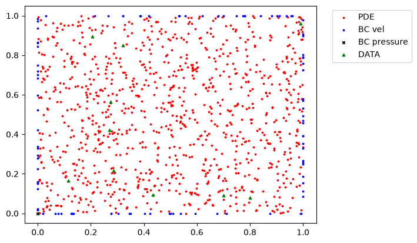

Los archivos de datos rotulados contienen 20201 puntos utilizados para el cómputo de los campos de presión y velocidades. Considerando que los puntos de colocación son en total 1101 (1000 de PDE, 100 de BC de velocidad y 1 de BC de presión), es posible que esta cantidad de puntos no sea suficiente para lograr el grado de precisión de la referencia. Adicionalmente, en los datos rotulados se tienen valores (constantes) para la posición y velocidad en la tercer dimensión espacial (profundidad del plano), aunque son todos nulos.

Respecto de considerar puntos de colocación de la PDE en las fronteras, mi entendimiento es que pueden contener y debe ser considerado el dominio total para realizar el muestreo aleatorio de los puntos de colocación, ya que en las fronteras también deben cumplirse las PDE estipuladas. En este caso, las esquinas superiores presentan discontinuidades importantes que dificilmente serán capturadas por la PINN si no se las considera en el conjunto de puntos de colocación.

## Implementación de esquema vanilla PINN

### 1. Implementación de la rutina de cálculo
En la notebook [TP1.ipynb](TP1.ipynb) se tiene la implementación de las actividades correspondientes, considerando como optimizador LBFGS, mientras que en [TP1_Adam.ipynb](TP1_Adam.ipynb) se considera como optimizador Adam. Se realizó con ambos optimizadores, ya que para casos de PINN donde se involucra la derivada segunda, es necesario utilizar un optimizador de segundo órden, como lo es LBFGS. Pero debido a que el optimizador "clásico" de Deep Learning es Adam, se quiso realizar la prueba de qué tan buenos resultados entregaba el mismo.

En [TP1_dense.ipynb](TP1_dense.ipynb) se consideraron 10 veces más puntos de colocación, tanto para PDE como para BC de velocidad.

Para LBFGS se entrenó durante 6000 epochs, con 20 iteraciones máximas internas por epoch.
Para Adam se consideró un entrenamiento de 40000 epochs.

Los tiempos de entrenamiento fueron:
| Optimizador | Tiempo entrenamiento |
| ----------- | -------------------- |
| LBFGS (1101 puntos) | 27 min |
| LBFGS (11001 puntos) | 111 min |
| Adam (1101 puntos) | 14 min | 

### 2. Resolución sin datos rotulados
Se entrena la PINN postulada, obteniendo los siguientes gráficos de evolución: 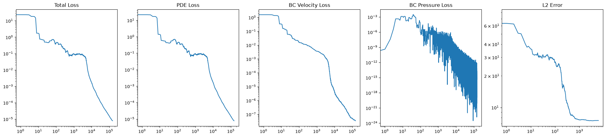
Se observa que las funciones de pérdida continuan descendiendo aunque el error L2 se estanca, esto indicaría que ya no se está mejorando la solución en general, pero se está disminuyendo la pérdida en los puntos de colocación.

Los campos de presión y velocidad se muestran a continuación. Se tiene concordancia en las formas de los campos, aunque el campo de presión no presenta los picos en la esquinas, presumiblemente debido a no tener puntos de colocación en las mismas. Un comporamiento similar se da para los campos de velocidad vertical. 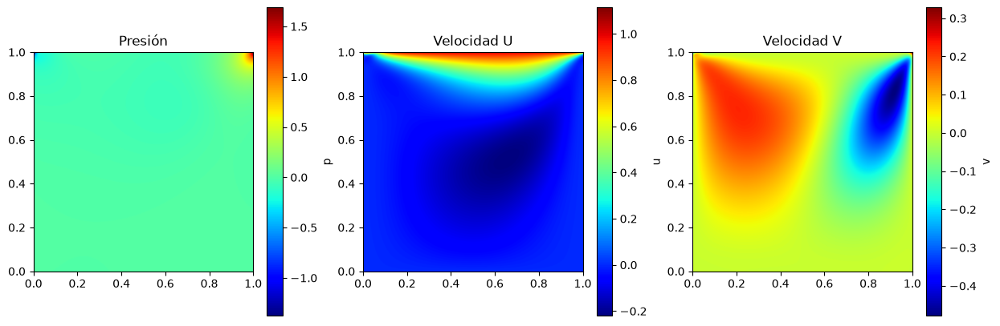

Para Adam se observa que la pérdida comienza a oscilar por encima de las 10000 epochs, con valores de la norma L2 del error superiores a LBGFS.  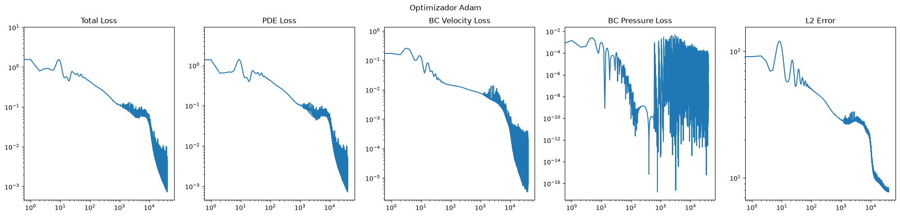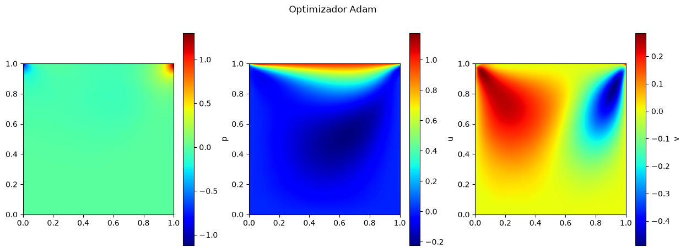

Con una mayor cantidad de puntos de colocación, LBFGS logra un menor error y valor de pérdida, intercambiando con mayores tiempos de entrenamiento. Además no se observa un estancamiento del error L2 como en el caso anterior con LBFGS. En este caso se logran valores pico más cercanos a la referencia para las presiones, y esquinas más definidas para la velocidad vertical. 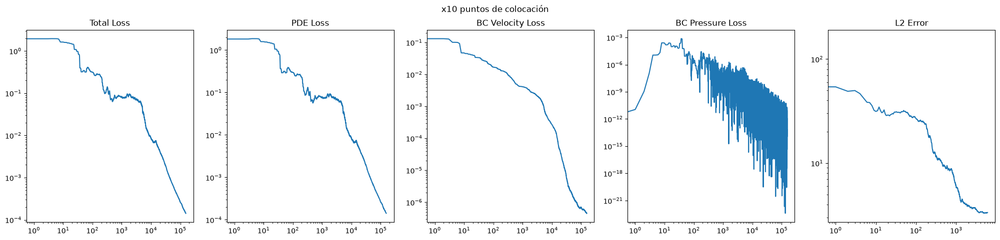 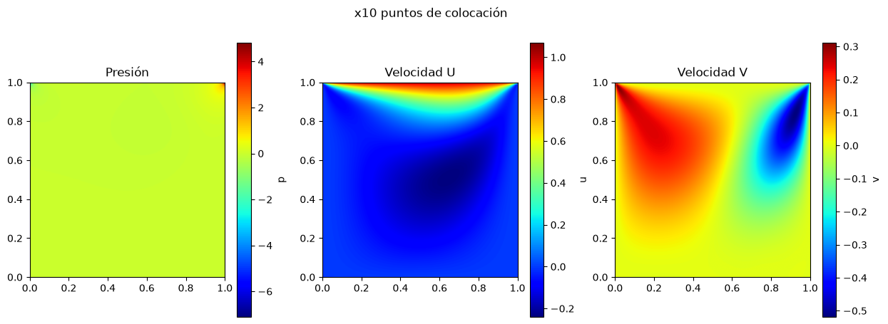

### 3. Cálculo norma-2 del error
Los valores de la norma L2 del error finales fueron:
| Optimizador | Norma L2 del error |
| ----------- | -------------------- |
| LBFGS (1101 puntos)   | 7.52 |
| LBFGS (11001 puntos)  | 3.35 |
| Adam (1101 puntos)    | 7.85 | 

Se tiene una mayor precisión del LBFGS con la malla densa de puntos, y un rendimiento levemente menor de Adam respecto de LBFGS.

### 4. Grafico del error absoluto
A continuación se muestra el gráfico del error absoluto. Se evidencia una dificultad en la zona de las esquinas superiores, donde se tienen las discontinuidades. 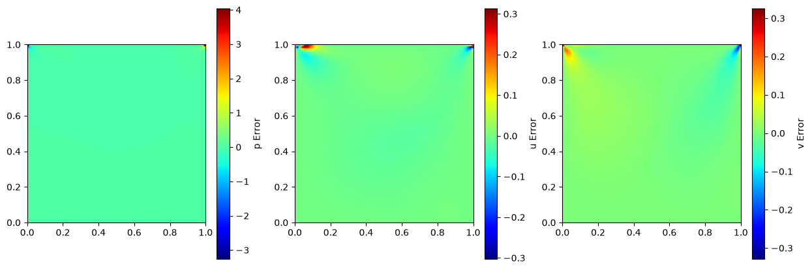

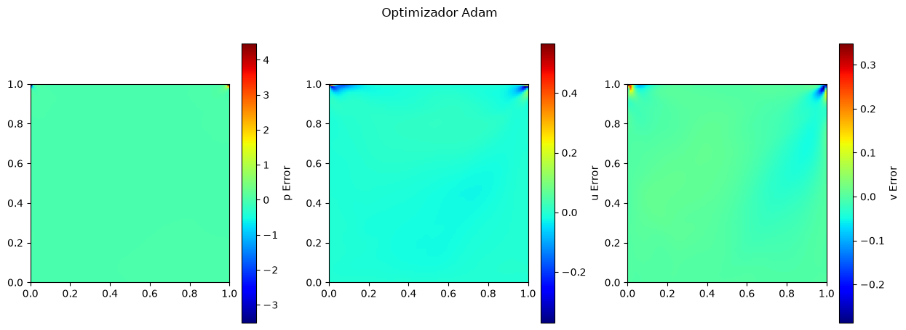

Para el caso con 10 veces más puntos de colocación se tiene el siguiente gráfico de error absoluto. Se tienen errores menores al caso anterior con LBFGS, casi nulos en presion y velocidad horizontal, con las zonas de las "plumas" de la velocidad vertical presentando los picos. 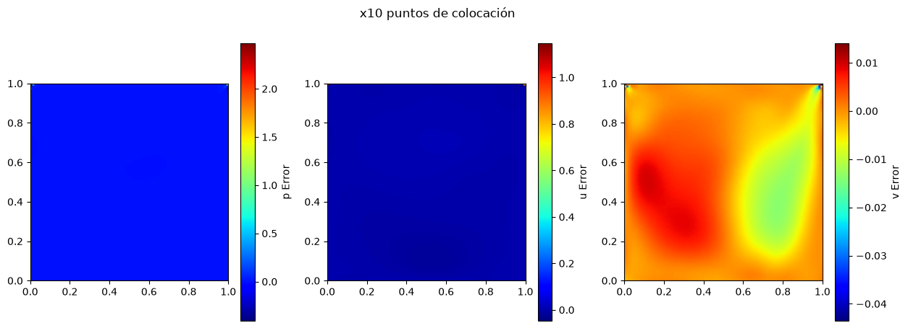

### 5. Perfiles de velocidad y presión en x=0.5 e y=0.5
A continuación se presentan los perfiles para el caso canónico. Se observa buena concordancia respecto del *ground truth*, con diferencias moderadas. 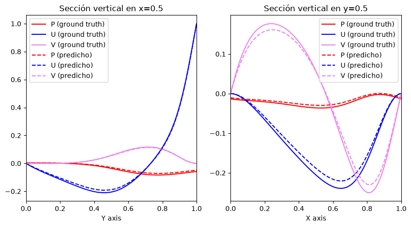

Utilizando Adam, los resultados son bastante similares. 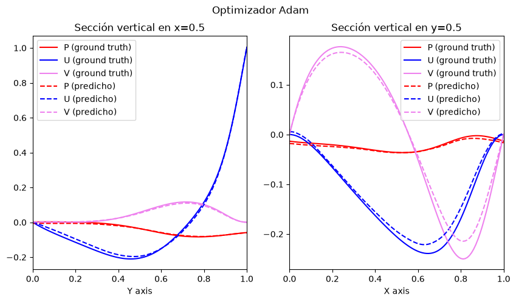

Utilizando 10 veces más puntos de colocación, los resultados son aún mejores que en el caso canónico. 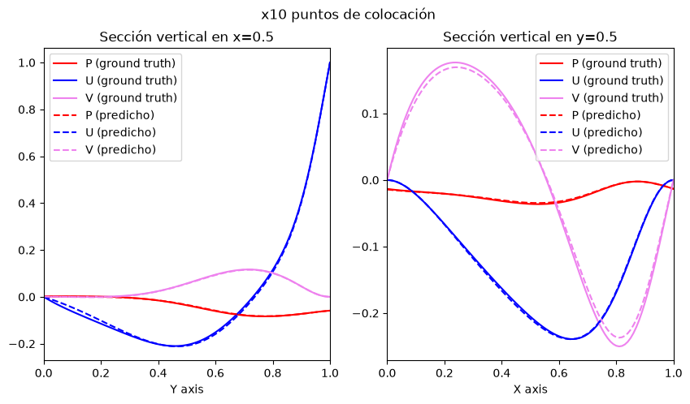

### 6. Conclusiones
Evaluando el modelo base, considero que su precisión es razonable para su cantidad de puntos de colocación, aunque un aumento de los mismos entrega una mejor predicción. Se observa una dificultad importante en la zona de las esquinas superiores. Se podría evaluar para solventar esto realizar un sampleo de una mayor cantidad de puntos en la proximidad de las esquinas superiores. El error en las zonas de las esquinas es del orden de los valores picos de los campos de presión y temperatura. 

Respecto de los hiperparámetros, se realizaron pruebas con redes más anchas y profundas sin mejores resultados. Se debe tener en cuenta que una red demasiado profunda puede dar el fenómeno de *vanishing gradients*, haciendo que el cálculo de gradientes tienda a valor nulo.

Considero que la mejora más importante para aumentar el rendimiento es la búsqueda de la cantidad óptima de puntos de colocación.