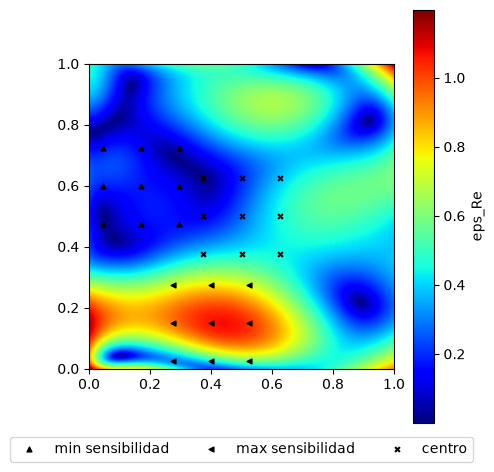
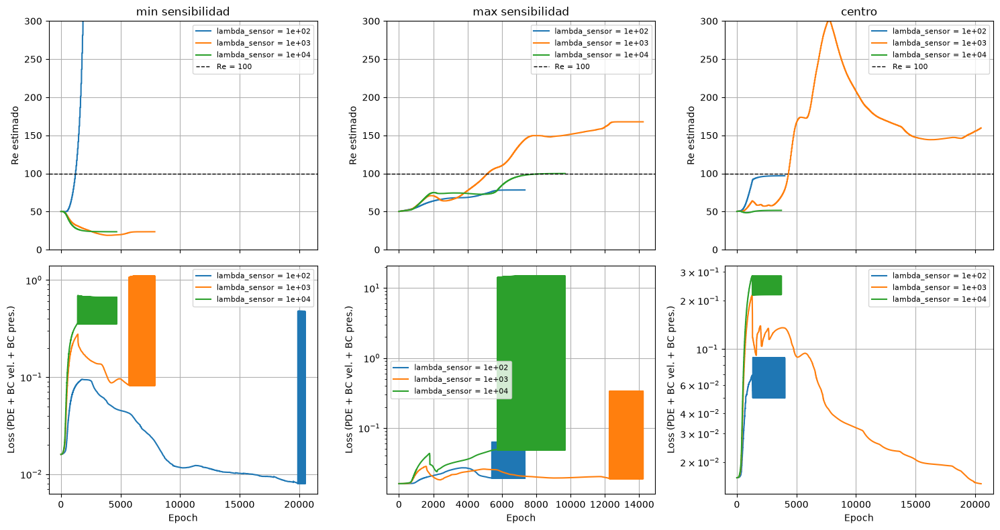
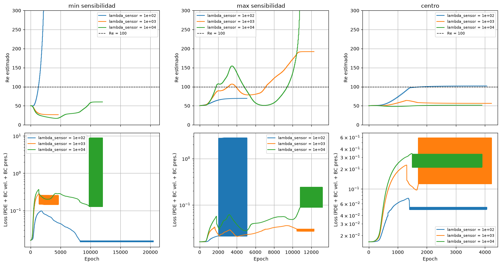

# TP3: Diseño experimental e identificación de Re

## Sensibilidad a priori
A continuación podemos observar el campo de sensibilidad. La sensibilidad se concentra en la zona de recirculación y en las esquinas. Con mínimo en la zona de velocidad ascendente.

## Configuraciones de sensores
Se posicionaron los sensores según la última imagen, en una grilla de 3x3 puntos y tamaño 0.25x0.25, según enunciado. La identificabilidad obtenida se puede ver en la siguiente tabla. Se tiene valor ascendente entre los nodos de menor sensibilidad, centro del dominio y nodos de máxima sensibilidad. Esto es lo esperado puesto que la identificabilidad es el cuadrado de la sensibilidad.

| Ubicación         | Punto         | Identificabilidad |
| -                 | -             | -     |
| Mín. Sensibilidad | (0.17,0.0.6)  | 1.87  |
| Centro            | (0.5,0.5)     | 2.68  |
| Máx. Sensibilidad | (0.4,0.15)    | 6.68  |

## Entrenamiento inverso

Para el entrenamiento inverso se realizaron ciertas modificaciones al procedimiento previo, para lograr la convergencia del modelo.

### Ajuste de distintos parámetros
Para el entrenamiento del modelo inverso, se realizaron una serie de ajustes para lograr una buena convergencia del modelo. Debido a que no se lograba consenso claro con los datos para el $\lambda$ a utilizar, se decidió realizar un barrido en 3 valroes: 100, 1000, 10000 veces el $\lambda_\mathrm{PDE}$ (de valor unitario en este caso). Por su parte el $\lambda_\mathrm{BC}$ se fijó en 10. 

**Optimizador del parámetro a aprender.** En lugar de optimizar el parámetro por medio del optimizador L-BFGS, se lo optimiza con SGD (1er orden). Esto permite que el parámetro evolucione independientemente, arrastrando al optimizador L-BFGS, y evitando que la PDE "trabe" el aprendizaje a partir de la información de los sensores.

**Pre-entrenamiento sin optimización del parámetro.** Se evaluó realizar un "pre-entrenamiento" del modelo con el valor inicial de Re, con el objetivo de inicializar los pesos de la red a valores "razonables" antes de comenzar al optimización del parámetro. De esta forma se logra un aprendizaje suave para ambos optimizadores.

**Peso de la pérdida sobre la data del sensor $\lambda_\mathrm{SENSOR}$.** Se ajustó también el peso que se aplica a la pérdida sobre la data del sensor, ajustando proporcionalmente respecto del $\lambda_\mathrm{PDE}$ en un factor de entre [100, 1000, 10000].

**Clamping sobre el parámetro a aprender.** Debido al *overshoot* mencionado previamente, se aplica un clamping al parámetro a aprender de forma que $\mathrm{Re}\in[1,10000]$.

**Actualización del parámetro en bloques.** Se realizó el entrenamiento de forma que el parámetro a optimizar sea actualizado por su optimizador cada $n$ epochs (y pasos del optimizador de los pesos de la red). De esta forma se logra una evolución más controlada y menos tendencia a la divergencia

### Resultados para caso nominal
Se observa que el caso de sensores de mínima sensibilidad no logra en ninguno de los 3 casos tener un Re convergido cercano a 100, y de hecho para $\lambda=1e2$ diverge. Luego el sensor de máxima sensibilidad logra el Re objetivo para $\lambda=1e4$, y el sensor central lo logra para $\lambda=1e2$. Mi interpretación de los resultados es que el modelo no es muy robusto y requiere de un *fine-tuning* demasiado iterativo, especialmente considerando que el tiempo de entrenamiento de cada modelo puede resultar prolongado según la capacidad computacional.

|sensor               |lambda_sensor | re final |  error % |
|---------------------|--------------|----------|----------|
|min sensibilidad     |        1e+02 |  5966.36 |+5866.36% |
|min sensibilidad     |        1e+03 |    23.51 |  -76.49% |
|min sensibilidad     |        1e+04 |    23.48 |  -76.52% |
|max sensibilidad     |        1e+02 |    78.29 |  -21.71% |
|max sensibilidad     |        1e+03 |   167.75 |  +67.75% |
|max sensibilidad     |        1e+04 |    99.90 |   -0.10% |
|centro               |        1e+02 |    96.94 |   -3.06% |
|centro               |        1e+03 |   159.68 |  +59.68% |
|centro               |        1e+04 |    51.56 |  -48.44% |

### Resultados con ruido
Al agregar ruido, sólo el sensor central logra acercarse al Re objetivo. Observando los resultados del sensor de máxima sensibilidad, quizas un $\lambda=300-500$ logre el Re objetivo, pero las 3 configuraciones planteadas no lo logran. Nuevamente el sensor de mínima sensibilidad diverge con $\lambda=1e2$.

|sensor               |lambda_sensor | re final |  error % |
|---------------------|--------------|----------|----------|
|min sensibilidad     |        1e+02 |  5832.26 | +732.26% |
|min sensibilidad     |        1e+03 |    26.58 |  -73.42% |
|min sensibilidad     |        1e+04 |    60.06 |  -39.94% |
|max sensibilidad     |        1e+02 |    69.44 |  -30.56% |
|max sensibilidad     |        1e+03 |   192.09 |  +92.09% |
|max sensibilidad     |        1e+04 |   598.19 | +498.19% |
|centro               |        1e+02 |   101.95 |   +1.95% |
|centro               |        1e+03 |    56.36 |  -43.64% |
|centro               |        1e+04 |    51.51 |  -48.49% |

